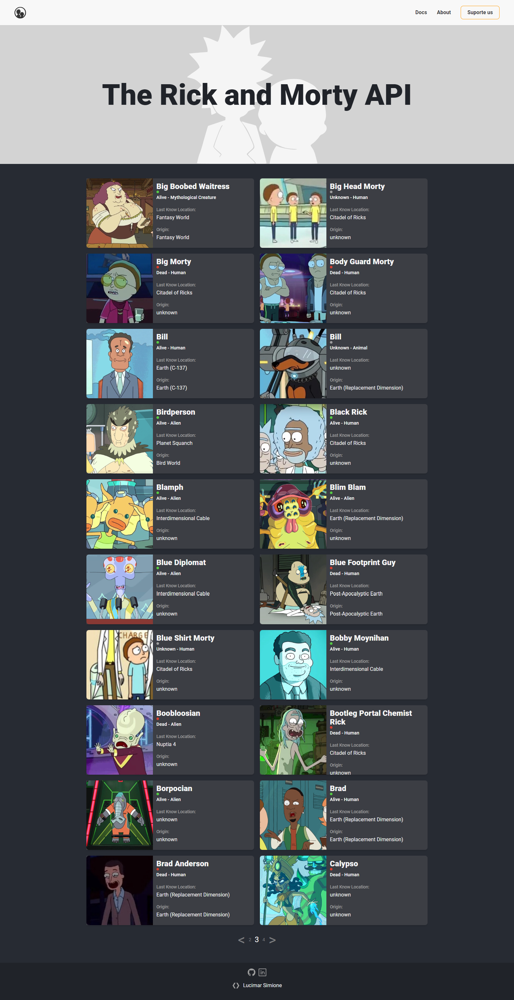

# The Rick and Morty API
Aplicação feita em React +Vite e javascript, feita com uso de API de terceiros.
 
Foi aplicado conceito de responsividade, para adequar tanto a celular como desktop.
 
Integrando API, arquivos de paginação, e feito com components, separados para melhor manuteção.
 
Projeto aula clube do portifolio DevClub.
 

